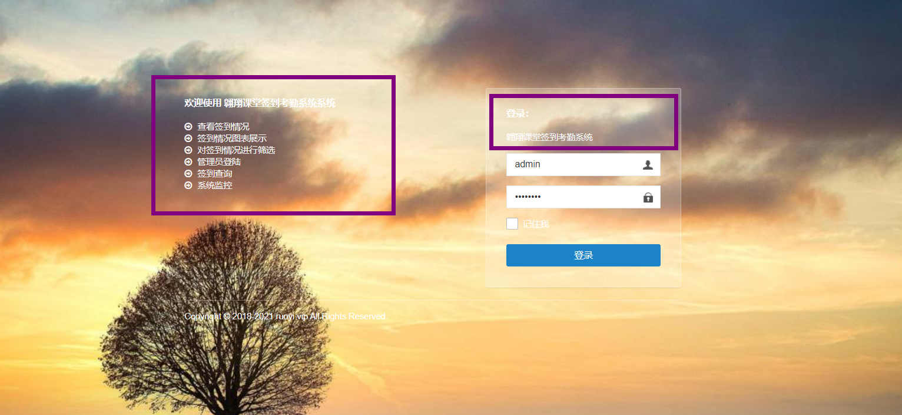
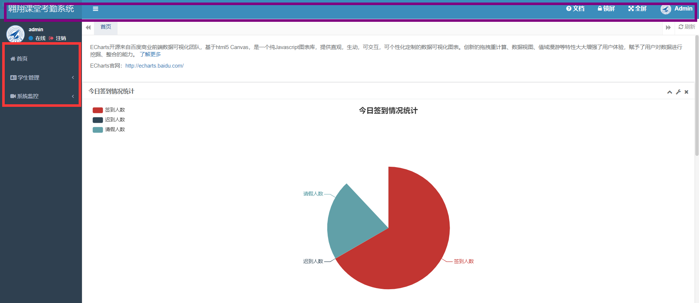
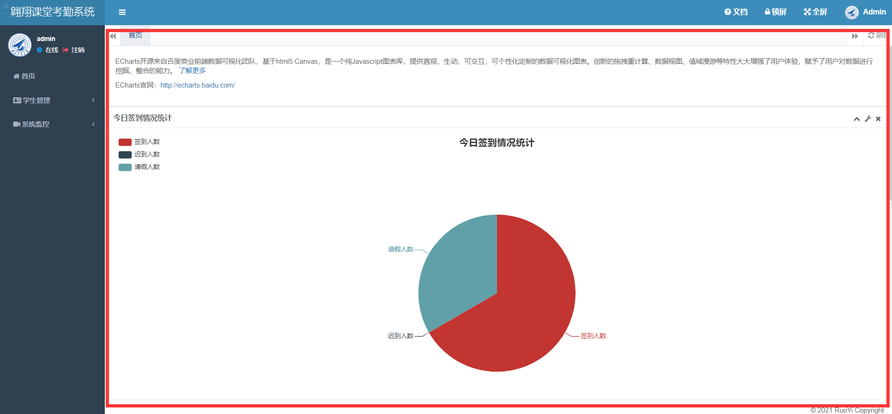
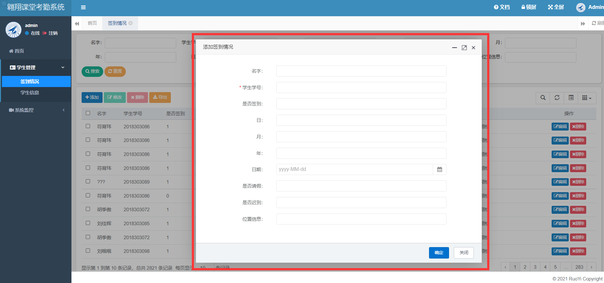
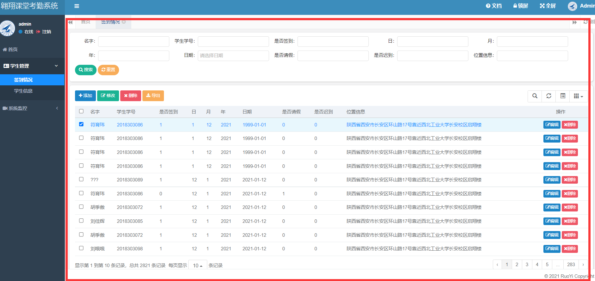
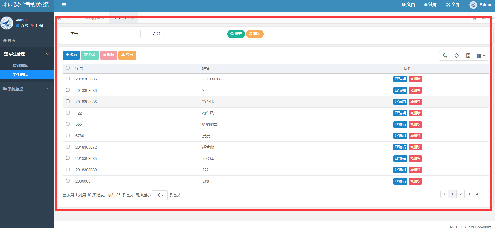
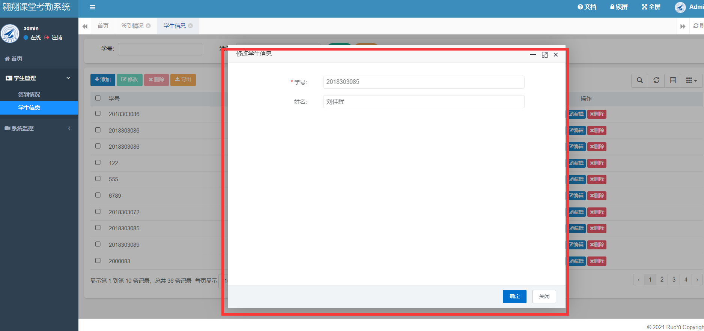

# 登陆页面

`src/main/resources/templates/login.html`

改动：主要是背景和图片

签到功能是一个表单，点击后会js提交到后端与数据库数据匹配，如果成功，登录成功

# 首页

`src/main/resources/templates/index.html`

存放的是index界面中的左侧导航和上侧导航

上侧导航内存存放在html文件中

左侧导航遍历数据库中的`sys_menu`表得到

`src/main/resources/templates/main.html`

存放首页显示的内容，在这里使用了百度的开源可视化库`echarts`。使用jQuery的getJson以及控制器获取后端数据库存放的数据，进行可视化

# 学生管理

## 签到情况

### 后端

1. `ruoyi-system/src/main/java/com/ruoyi/system/controller/AttendanceController.java`

控制器，将数据库的内容存放在某个路径下，在被请求的时候查询数据库，返回数据

2. `ruoyi-system/src/main/java/com/ruoyi/system/domain/Attendance.java`

Attendance类，存放Attendance所有的属性和方法，主要是get和set方法

3. `ruoyi-system/src/main/java/com/ruoyi/system/mapper/AttendanceMapper.java`

接口，和数据库相关

4. `ruoyi-system/src/main/java/com/ruoyi/system/service/IAttendanceService.java`

`AttendanceService`接口,数据库设置的方法

5. `ruoyi-system/src/main/java/com/ruoyi/system/service/impl/AttendanceServiceImpl.java`

`AttendanceService`接口的实现

6. `ruoyi-system/src/main/resources/mapper/system/AttendanceMapper.xml`

   存放`sql`查询语句

### 前端

`ruoyi-admin/src/main/resources/templates/system/attendance/add.html`

添加界面，调用后端insert

`ruoyi-admin/src/main/resources/templates/system/attendance/attendance.html`

签到情况主页面

`ruoyi-admin/src/main/resources/templates/system/attendance/edit.html`

签到情况编辑页面

## 学生信息

### 后端

1. `ruoyi-system/src/main/java/com/ruoyi/system/controller/StudentController.java`

控制器，将数据库的内容存放在某个路径下，在被请求的时候查询数据库，返回数据

2. `ruoyi-system/src/main/java/com/ruoyi/system/domain/Student.java`

Student类，存放Student所有的属性和方法，主要是get和set方法

3. `ruoyi-system/src/main/java/com/ruoyi/system/mapper/StudentMapper.java`

接口，和数据库相关

4. `ruoyi-system/src/main/java/com/ruoyi/system/service/IStudentService.java`

`StudentService`接口,数据库设置的方法

5. `ruoyi-system/src/main/java/com/ruoyi/system/service/impl/StudentServiceImpl.java`

`StudentService`接口的实现

6. `ruoyi-system/src/main/resources/mapper/system/StudentMapper.xml`

   存放`sql`查询语句

### 前端

`ruoyi-admin/src/main/resources/templates/system/Student/add.html`

添加界面，调用后端insert

`ruoyi-admin/src/main/resources/templates/system/Student/attendance.html`

签到情况主页面

`ruoyi-admin/src/main/resources/templates/system/Student/edit.html`

签到情况编辑页面

